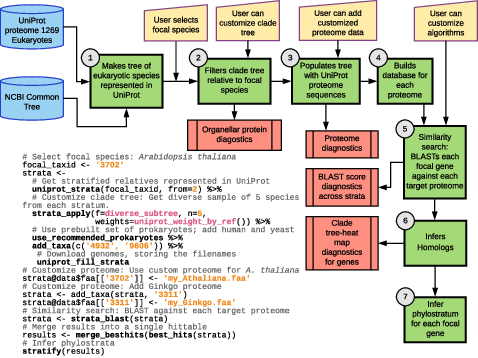

[](http://github.com/badges/stability-badges)
[](https://travis-ci.org/arendsee/phylostratr)
[](https://codecov.io/github/arendsee/phylostratr?branch=master)
[](https://zenodo.org/badge/latestdoi/109036472)

# phylostratr

Predict and explore the age of genes using phylostratigraphic methods.



## Installation

You can install from GitHub with:

```{r github-installation, eval=FALSE}
library(devtools)
install_github("arendsee/phylostratr")
```

## Dependencies

 * R packages from CRAN (see DESCRIPTION)
 * `Biostrings` from Bioconductor, install with `devtools::install_bioc("Biostrings")`
 * `NCBI BLAST+` - `blastp` (the protein BLAST command) must be in `PATH`. You
   can tell if `blastp` is properly installed by calling `blastp -help` from
   the command line.

## Citation

    Zebulun Arendsee, Jing Li, Urminder Singh, Arun Seetharam, Karin Dorman,
    Eve Syrkin Wurtele (2019) "phylostratr: A framework for phylostratigraphy." Bioinformatics. https://doi.org/10.1093/bioinformatics/btz171

## Funding

This work is funded by the National Science Foundation grant:

[NSF-IOS 1546858](https://www.nsf.gov/awardsearch/showAward?AWD_ID=1546858)
Orphan Genes: An Untapped Genetic Reservoir of Novel Traits
